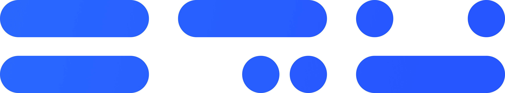

<br>

<div align="center">
  

### **한글 프로그래밍 언어 DoKev**
DoKev는 쉽고, 자연스러운 한글 프로그래밍 언어입니다!<br>
마음이 가는대로 코드를 작성하고, 실행하세요!

</div>

> [!CAUTION]
> 현재 레포지토리에 있는 C#과 C++ 버전의 DoKev는 개발이 중단되었습니다!
> [이 곳](https://github.com/BackGwa/DoKev)으로 이동하여, 새로운 버전의 DoKev를 확인하세요!

<br>

## **설치**
1. `Releases`에서 자신의 운영체제에 맞게 최신 엔진을 다운로드 해주세요.

<br>

> [!NOTE]
>  현재 `Releases`에서 배포되고 있는 버전은 C#을 기반으로 하고 있으며,
> 일부 문법과 호환되지 않습니다. C# 기반의 DoKev를 사용하고 싶다면, 해당 [문서](https://backgwa.notion.site/backgwa/DoKev-46bc63939be74aa28d3247ed2ec8d415)를 참고하세요!

<br>

## **C++ 버전 빌드**
* Linux & macOS
```sh
git clone https://github.com/BackGwa/DoKev.git

cd "./DoKev/src/DoKevEngine (Deprecation)"
sh ./build.sh
```

---

