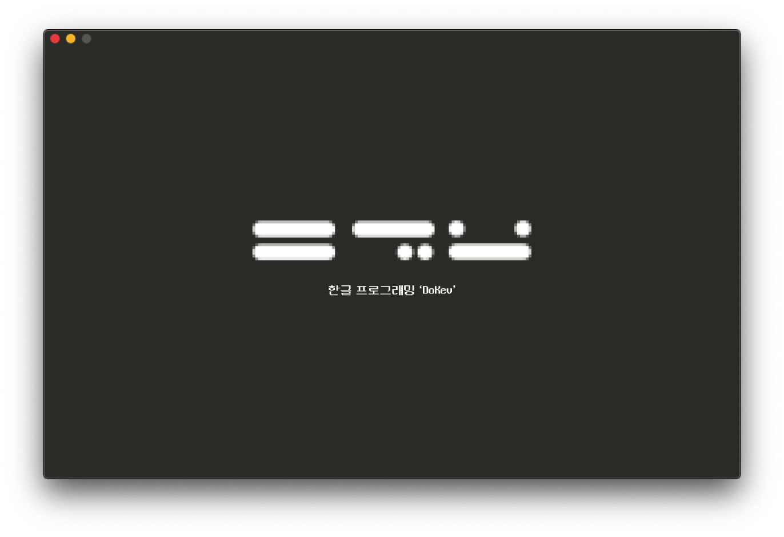

<br>

<!--  -->

## <p align="center"><b>2023년 3월 1일 'DoKev'가 새단장되어 돌아옵니다!</b></p>
##### <p align="center">현재보다 더욱 완성도 있는 모습으로 달라진 DoKev를 기대해주세요!</p>

<br>

<hr>

<br>

## **코드 수정 및 실행**

<br>

### 추천 에디터
#### 다음 에디터를 통하여 수정하시는 것을 추천드립니다!
* Visual Studio Code
* Notepad++

<br>

### 코드 빌드 및 실행
#### 폴더 내 ```dkcv.exe```를 실행하여 작성한 프로그램을 실행시킬 수 있습니다.
#### 이때 작성한 ```*.do``` 확장파일은 <span style="color:#ff5553">**무조건,**</span> convert.do와 같은 이름이여야 합니다.

<br>

<hr>

<br>

## **예제 코드**

```py

# 라이브러리 가져오기
필요한 라이브러리는 random이야


# 출력
말해줘(@"안녕, 세상아!")


# 변수 선언 & 입력
변수_가는 입력받아줘(@"입력해줘! >> ")
변수_나는 0이야

# 자료형 변환
변수_가는 정수형으로(변수_가)야


# if 문
혹시나(변수_가 == 10)이라면 #if문
    말해줘(@"값이 10이구나!")

# elif 문
그게 아니면(변수_가 == 20)이라면 #elif문
    말해줘(@"값이 20이구나!")

# else 문
모두 아니면
    말해줘(@"값을 모르겠어...")


#while문
반복해줘(변수_나 < 5)이라면 #while 문
    말해줘(@"반복 횟수 : {}".문자형식(변수_나))
    변수_나를 증가해줘
    빠져나오자


# for 문
증감반복해 연산변수 이걸 [1, 2, 3, 4, 5]이걸로
    말해줘(@"연산변수 값 : {}".문자형식(연산변수))


# 함수선언
약속하자 더해버리자 함수는(가_변수과 나_변수)가 필요해
    반환해줘 가_변수 + 나_변수


```
<br>

<hr>

<br>

## **에약어**
#### 다음 내용을 일부라도 **포함**하는 변수 이름이나 함수 이름으로는 사용할 수 없습니다.  

<br>

```
* 필요한 라이브러리는 & 라이브러리
* 말해줘 & 출력해줘 & 출력해 & 보여줘
* 입력받아줘 & 입력받아
* 반복해줘 & 반복해
* 증감반복해
* 이걸 & 저걸
* 이걸로 & 저걸로
* 빠져나와줘 & 빠져나오자 & 빠져 % 나와 & 나가
* 문자형식 & 형식 & 포맷
* -이라면 & -라면 & -면
* 증가해줘 & 감소해줘 & 증가 & 감소
* 증감해줘
* 정수 & 실수 & 문자열 & 불 & 널 & 빈공간 & 문자
* 절댓값 & 수식 & 16진수 & 8진수 & 문자길이 & 길이 & 헥스 & 악틀
* 아니
* 거꾸로 & 반대
* 혹시나 & 혹여나 & 혹시 & 만약에 & 만약
* 그게 아니면 & 그게 아니라면
* 모두 아니면 & 모두 아니라면 & 다 아니면 & 다 아니라면
* 약속하자 & 약속해 & 약속 & 선언하자 & 선언해 & 선언
* 함수는
* 가 필요해 & 이 필요해
* 더하기 & 빼기 & 곱하기 & 나누기 & 나머지 & 합 & 차 & 몫 & 거듭 제곱 & 제곱 & 승
* 이야 & 야
* 은 & 는
* 을 & 를
* 참 & 거짓 & 진짜 & 가짜 & 진실
* 그리고 & 또는
* 반환해줘 & 반환해 & 돌려줘 & 던져줘
* 이랑 & 랑 & 과 & 와
* {tktp+INDEX}

[이 외 제어문자]
```

```
[random 라이브러리 사용 시]

* 랜덤 & 랜덤정수 & 랜덤실수 & 랜덤범위정수 & 여럿값선택 & 선택 & 섞기
```

```
[os 라이브러리]

* 운영체계
* 현재경로 & 경로여부 & 절대경로 & 경로생성 & 경로삭제 & 경로변경 & 경로명
* 파일목록 & 파일탐색 & 파일여부 & 파일명 & 파일크기 & 파일삭제 & 상태 & 이름변경
* 폴더변경
* 명령
```

## **패치노트**
* 최신 업데이트 : 220927.01
```
버전 : 220927.01

* dkcv.exe 성능개선
```
```
버전 : 220926.01

* 소소한 변경사항
```
```
버전 : 220718.02

* random.kev 파일이 수정되었습니다.
  [버그 수정]
```
```
버전 : 220718.01

* dkcv.exe가 새로운 버전으로 업데이트 되었습니다.
  [성능 개선 및 알고리즘 개선]
```
```
버전 : 220717.01

* 문법의 개선을 위해 *.kev 파일이 수정되었습니다.
  이제부터 대부분의 말이 대치됩니다.
```
```
버전 : 220715.04

* 소소한 버그 수정
```
```
버전 : 220715.03

* os 라이브러리가 기본으로 적용됩니다.
* dkpl.exe가 제거되고 'python 3.10.5 embed'가 적용됩니다.
```
```
버전 : 220715.02

* dkcv.exe가 새로운 버전으로 업데이트 되었습니다.
* 라이브러리 지원을 위해 새로운 *.kev 파일이 추가되었습니다. [os 모듈 지원]
* 일부 라이브러리가 한국어로 많은 기능을 지원합니다. [random 모듈 확장]
* 일부 어색한 문법의 개선을 위해 *.kev 파일이 수정되었습니다.
* 이제부터 예제코드는 출력으로만 제공됩니다.
```
```
버전 : 220715.01

* dkpl.exe가 새로운 버전으로 업데이트 되었습니다.
* 문자를 지원합니다. [str]
```
```
버전 : 220714.06

* 라이브러리가 작동하지 않던 버그를 수정했습니다.
```
```
버전 : 220714.05

* 기존 파이썬 라이브러리 일부를 지원합니다. [ironPython.stdlib]
  현재 한글을 지원하는 라이브러리는 <random>입니다.

  그 외 라이브러리는 영문으로 지원합니다.


* dkpl.exe가새로운 버전으로 업데이트 되었습니다.
* 라이브러리 지원을 위해 새로운 *.kev 파일이 추가되었습니다.
* 일부 어색한 문법의 개선을 위해 *.kev 파일이 수정되었습니다.
* 예제가 수정되었습니다.
```
```
버전 : 220714.04

* dkcv.exe의 버그를 수정하였습니다.
```
```
버전 : 220714.03

* 일부 어색한 문법의 개선을 위해 *.kev 파일이 수정되었습니다.
```
```
버전 : 220714.02

* dkcv.exe의 UI가 변경되었습니다.
* dkcv.exe의 버그를 수정하였습니다.
```
```
버전 : 220714.01

* 문자열 예외처리 기능이 추가되었습니다.

  @"입력할 문자" 와같이 따옴표 앞에 @를 붙이시면 해당 문자열을 예외처리 됩니다.  
  예외 처리는 한국어 문자열 입력 시에만 해주시면 됩니다.


* dkcv.exe의 UI가 변경되었습니다.
```
```
버전 : 220713.02

* 번역 충돌을 방지하기 위해 *.kev 파일이 수정되었습니다.
* for문이 추가되었습니다.
* 기본 예제 코드를 수정하였습니다.
```
```
버전 : 220713.01

* 일부 어색한 문법의 개선을 위해 *.kev 파일이 수정되었습니다.
* 일부 자료형을 더 추가하였습니다.
* 제어문자를 추가하였습니다.
* 계산 관련 함수를 일부 더 추가하였습니다.
* 기본 예제 코드를 수정하였습니다.
```
<br>

<hr>

<br>

## **커피 사주기**
카카오뱅크 7777-01-6897567
